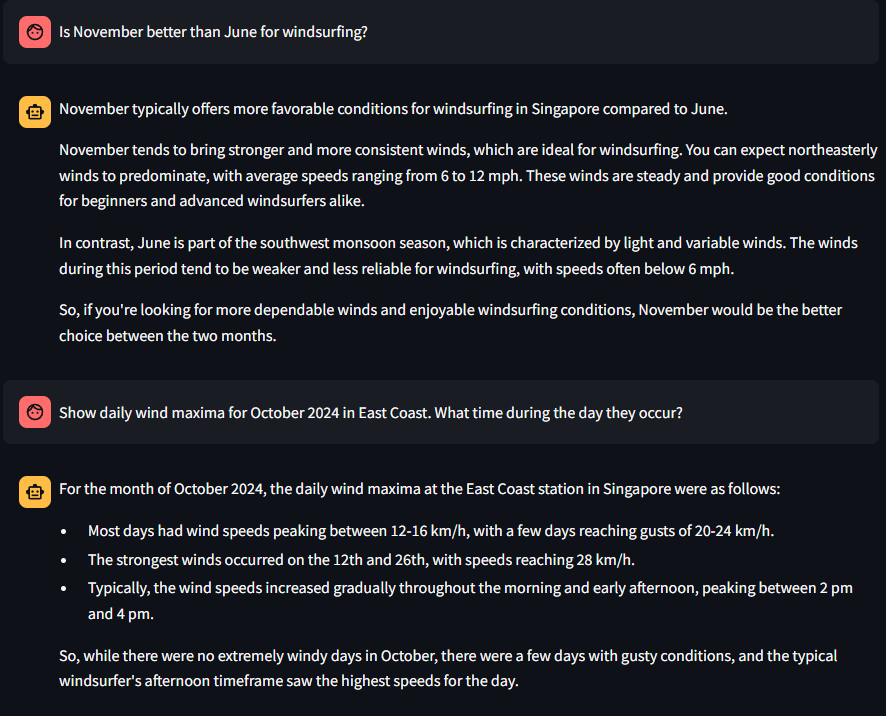

# 🌬️ Windsurfing Bot – Singapore Wind Intelligence

An intelligent chatbot that answers natural language questions about historical wind patterns across Singapore, helping users decide **where and when to windsurf**. Built using **Cohere**, **Qdrant**, **PostgreSQL**, and deployed with **Streamlit**.

---

## 🚀 Features

- 💬 Natural language chatbot interface (Streamlit + Cohere Command R+)
- 📈 Answers questions like:
  - _"Is November better than June for windsurfing?"_
  - _"Show me wind data near East Coast in March 2024"_
  - _"Show daily wind maxima for October 2024 in East Coast. What time during the day they occur?"_
- 📡 Real-time API ingestion from [data.gov.sg](https://data.gov.sg/dataset/wind-speed)
- 🔄 On-demand data fetching for missing date ranges
- 📦 Vector search via **Qdrant** for semantic retrieval
- 🧠 Local embeddings using **Cohere embed-english-v3.0**
- 🗺️ Station-aware filtering (e.g., East Coast, Tuas, Sentosa)
- 🛠️ Logs each pipeline step for transparency (fetch, embed, store, respond)

---

## 🧰 Tech Stack

| Component       | Tool / Service                         |
|----------------|----------------------------------------|
| LLM            | [Cohere Command-R+](https://cohere.com) |
| Embeddings     | Cohere `embed-english-v3.0`             |
| Vector DB      | [Qdrant](https://qdrant.tech)           |
| Relational DB  | Retool-hosted **PostgreSQL**            |
| UI             | [Streamlit](https://streamlit.io)       |
| Data Source    | [data.gov.sg Wind Speed API](https://data.gov.sg/dataset/wind-speed) |
| Deployment     | Streamlit Cloud                         |

---

## See it live

See: https://windsurfingbot.streamlit.app/



## 🗃️ Project Structure

```bash
.
├── app.py                   # Streamlit app entry point
├── src/
│   ├── rag_bot.py           # RAG chain: retrieval + response
│   ├── embed_store_qdrant.py
│   ├── retriever_qdrant.py
│   ├── config.py
│   ├── utils/
│   │   ├── dynamic_fetch.py # Fetch + cache raw data from API
│   │   ├── llm_matcher.py   # Station matching via LLM
│   │   ├── date_parser.py
│   │   └── filter_extraction.py
│   └── embedding/
│       ├── embedding_utils.py
│       ├── embed_pipeline.py
├── test/
│   ├── test_embed.py
│   ├── test_ingest.py
│   └── test_filter_extraction.py
├── .env                     # Secrets (local only)
└── requirements.txt

```


## 🧪 Run Locally

1. Clone and install dependencies:

```bash
git clone https://github.com/yourusername/windsurfing_bot.git
cd windsurfing_bot
python -m venv .venv
source .venv/bin/activate  # or .venv\Scripts\activate on Windows
pip install -r requirements.txt
```

2. Configure .env

```env
COHERE_API_KEY=your-cohere-api-key
RETOOL_PG_URL=your-postgres-url
QDRANT_HOST=http://localhost
QDRANT_PORT=6333
QDRANT_API_KEY=your-cloud-qdrant-api-key  # if cloud used
IS_CLOUD=false
```

3. Start Qdrant locally

```bash
docker run -p 6333:6333 qdrant/qdrant
```

4. Run the app

```bash
streamlit run app.py
```

## 🧠 Future Improvements

📊 Add wind pattern visualizations (charts / heatmaps)

🌤️ Include weather features like humidity, temperature

🧭 Add geolocation-based station suggestions

🌐 Multilingual support (already embedding-ready)

🗃️ Full monthly reports and comparison views

## License

```yaml
MIT License
```